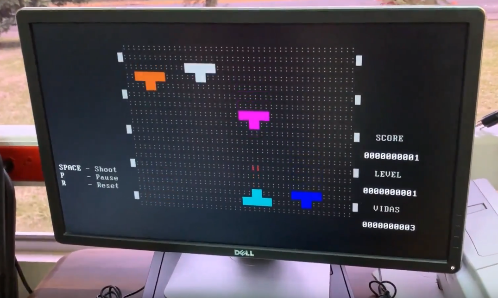

# Bare_metal_game
Bare metal programming, a game example, using the C programming language.

  

## Demo

Here's a video about loading the file into a bootable USB, and executing it on a real computer

[Youtube Video](https://www.youtube.com/watch?v=88PV7780HPg "Youtube Video")

>     Make sure you have QEMU installed on your computer to run it! 

__________________

## Overview

The game has 2 levels:

1. Shoot and kill 20 enemies
2. Avoid 20 red points

Now lets see how they look on QEMU:

LEVEL 01 | LEVEL 2 
------------ | ------------- 
 |  

### Controls

